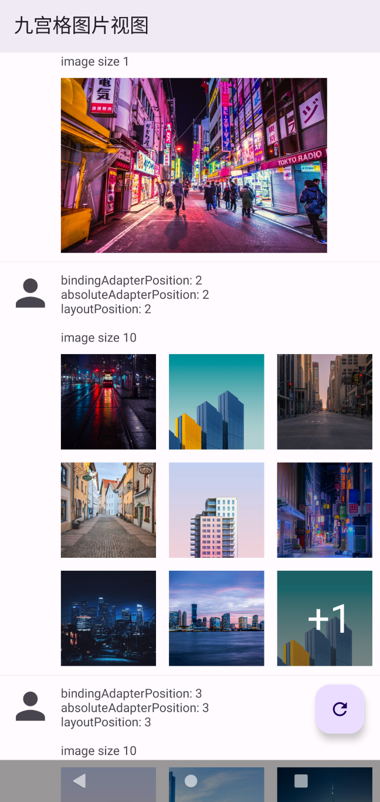

<p align="center">
 
 <h2 align="center">九宫格图片视图</h2>
 <p align="center"><strong>一个用来显示九宫格图片的控件，常用于动态列表等</strong></p>
 <p align="center"><strong>当前状态：开发中</strong></p>
</p>

## 预览 🔎



## 使用 ⚡

TODO

## 声明 📄

本项目采用的图片资源来自以下网站

- [演示图片来源](https://www.apple.com.cn)
- [图标来源](https://www.iconfont.cn/user/detail?uid=19083)

## 感谢 ❤

特别感谢 [liangchaojie/NineGridLayout](https://github.com/liangchaojie/NineGridLayout) 

## LICENSE ⚖

<details>
<summary><strong>MIT License</strong></summary>

<br />

```
MIT License

Copyright (c) 2021 Plain

Permission is hereby granted, free of charge, to any person obtaining a copy
of this software and associated documentation files (the "Software"), to deal
in the Software without restriction, including without limitation the rights
to use, copy, modify, merge, publish, distribute, sublicense, and/or sell
copies of the Software, and to permit persons to whom the Software is
furnished to do so, subject to the following conditions:

The above copyright notice and this permission notice shall be included in all
copies or substantial portions of the Software.

THE SOFTWARE IS PROVIDED "AS IS", WITHOUT WARRANTY OF ANY KIND, EXPRESS OR
IMPLIED, INCLUDING BUT NOT LIMITED TO THE WARRANTIES OF MERCHANTABILITY,
FITNESS FOR A PARTICULAR PURPOSE AND NONINFRINGEMENT. IN NO EVENT SHALL THE
AUTHORS OR COPYRIGHT HOLDERS BE LIABLE FOR ANY CLAIM, DAMAGES OR OTHER
LIABILITY, WHETHER IN AN ACTION OF CONTRACT, TORT OR OTHERWISE, ARISING FROM,
OUT OF OR IN CONNECTION WITH THE SOFTWARE OR THE USE OR OTHER DEALINGS IN THE
SOFTWARE.
```
</details>